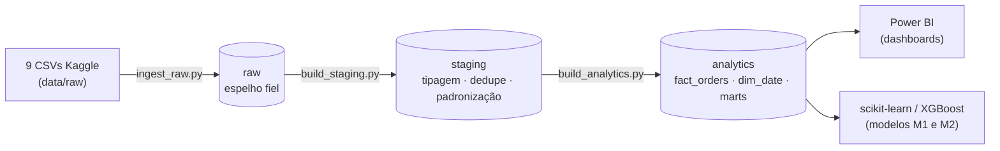
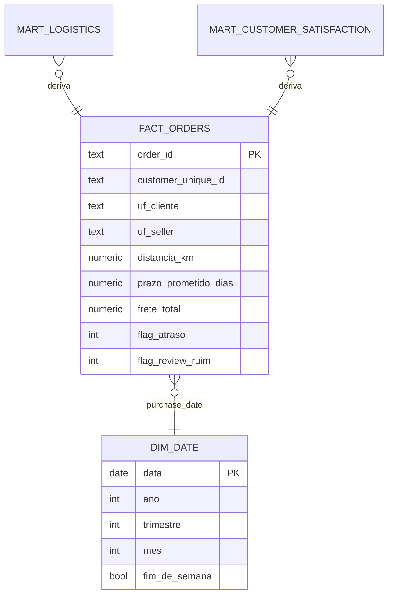

<p align="center">
  
</p>

# Olist Logistics Prediction

> **Análise e predição de performance logística e satisfação de clientes em um marketplace brasileiro.**
> Projeto data fullstack cobrindo Engenharia de Dados, Análise/BI e Ciência de Dados sobre o
> *Brazilian E-Commerce Public Dataset by Olist* (Kaggle).

---

## 1. Problema de negócio

> **Quais fatores explicam atrasos de entrega e quedas de satisfação — e é possível prever ambos antes que aconteçam?**

Dois alvos de modelagem, ambos no grão de **1 linha = 1 pedido**:

| Modelo | Alvo | Regra |
|--------|------|-------|
| **M1 — Atraso logístico** | `flag_atraso` | `order_delivered_customer_date > order_estimated_delivery_date` |
| **M2 — Cliente insatisfeito** | `flag_review_ruim` | `review_score <= 3` |

---

## 2. Stack

`Python` · `Pandas` · `SQLAlchemy/psycopg2` · `PostgreSQL (Neon serverless)` ·
`scikit-learn` · `XGBoost` · `SHAP` · `SciPy/statsmodels` · `Power BI`

---

## 3. Arquitetura — Pipeline Medallion



- **raw** — espelho fiel dos CSVs (auditoria/rastreabilidade).
- **staging** — views com tipos corrigidos, datas, padronização de texto e deduplicação.
- **analytics** — modelo dimensional + *marts* prontos para BI/ML.

Orquestração: `python src/run_etl.py` roda as três etapas em sequência (idempotente).

---

## 4. Modelo dimensional (star schema)



Os dois `mart_*` são views "achatadas" sobre `fact_orders`, autocontidas para consumo direto
no Power BI e no ML. Dicionário completo em [`docs/dicionario_dados.md`](docs/dicionario_dados.md);
regras de negócio em [`docs/regras_negocio.md`](docs/regras_negocio.md).

---

## 5. Como rodar

### 5.1 Pré-requisitos
- Python 3.11+
- Conta no [Neon](https://neon.tech) (PostgreSQL serverless) com a *connection string*
- Credenciais da Kaggle API (para baixar os dados)

### 5.2 Setup
```bash
python -m venv .venv && source .venv/bin/activate
pip install -r requirements.txt
cp .env.example .env          # preencha DATABASE_URL, KAGGLE_USERNAME, KAGGLE_KEY
```

### 5.3 Dados (Kaggle)
```bash
kaggle datasets download -d olistbr/brazilian-ecommerce -p data/raw
unzip data/raw/brazilian-ecommerce.zip -d data/raw
```

### 5.4 Banco + ETL
```bash
# cria os schemas raw/staging/analytics (rode 00_schemas.sql no SQL Editor do Neon ou via Python)
python src/run_etl.py          # raw → staging → analytics (com data quality checks)
```

### 5.5 Análises e modelos
```bash
jupyter lab    # execute 01_eda → 02_estatistica → 03_modelagem
```

---

## 6. Principais resultados

### 6.1 Análise estatística ([`02_estatistica.ipynb`](notebooks/02_estatistica.ipynb))

| Hipótese | Teste | Resultado | Tamanho de efeito |
|----------|-------|-----------|-------------------|
| Atraso reduz a satisfação | Mann-Whitney U | p < 0.001 | Cliff's δ = 0.55 (**grande**) |
| Frete varia por região | Kruskal-Wallis | p < 0.001 | η² = 0.16 (**grande**) |
| Tipo de pagamento × insatisfação | Qui-quadrado | p = 0.02 | Cramér's V = 0.01 (negligível) |
| Frete × lead time | Spearman | p < 0.001 | ρ = 0.38 (média) |

> Lição relevante: o tipo de pagamento é estatisticamente significativo mas **irrelevante na prática** (efeito negligível) — significância ≠ relevância.

### 6.2 Modelos ([`03_modelagem.ipynb`](notebooks/03_modelagem.ipynb))

| Modelo | Melhor algoritmo | AUC-ROC | CV AUC (5-fold) |
|--------|------------------|---------|-----------------|
| M1 — Atraso | XGBoost | **0.78** | 0.786 ± 0.005 |
| M2 — Review ruim | XGBoost | **0.71** | 0.715 ± 0.004 |

- **Anti-leakage:** o M1 usa apenas features conhecidas no momento da compra. A feature de maior ganho foi `prazo_prometido_dias` (prazo prometido no checkout), seguida da `distancia_km` (Haversine) — juntas elevaram o AUC de ~0.75 → ~0.78.
- **Avaliação rigorosa:** baseline (`DummyClassifier`), validação cruzada, tuning (`RandomizedSearchCV`), **threshold custo-sensível** (`reports/m1_threshold.png`) e **SHAP** (`reports/m1_shap_summary.png`).
- **Insight de negócio:** o M2 é dominado por `atraso_dias`/`flag_atraso`, confirmando empiricamente a H1 (atraso → insatisfação).

Figuras de apoio em [`reports/`](reports/).

---

## 7. Estrutura do projeto

```
olist-logistics-prediction/
├── data/raw/            # CSVs do Kaggle (não versionado)
├── notebooks/           # 01_eda · 02_estatistica · 03_modelagem
├── src/                 # config · ingest_raw · build_staging · build_analytics · run_etl
├── sql/                 # 00_schemas · 01_staging_views · 02_analytics_ddl · 03_business_queries
├── models/              # modelos .pkl (não versionado — regeneráveis)
├── reports/             # figuras exportadas (versionadas)
├── powerbi/             # dashboard .pbix
├── docs/                # dicionário de dados + regras de negócio
└── requirements.txt
```

> **Decisões de versionamento:** `data/raw/`, `.env` e `models/*.pkl` ficam fora do git
> (dados pesados, segredos e artefatos regeneráveis). As figuras de `reports/` são versionadas
> por servirem de portfólio. Os notebooks são versionados **com saídas** para visualização direta no GitHub.

---

## 8. Status do projeto

- [x] Fase 0–2 — Setup, aquisição e EDA
- [x] Fase 3–5 — Modelagem dimensional, Neon e ETL (raw → staging → analytics)
- [x] Fase 6 — SQL Analytics (12 queries de negócio)
- [x] Fase 7 — Análise estatística (4 testes com tamanho de efeito)
- [x] Fase 8 — Ciência de dados (2 modelos, sem leakage, tuning + threshold + SHAP)
- [ ] Fase 9 — Dashboard Power BI
- [ ] Fase 10 — Fechamento de portfólio
