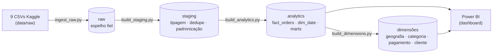
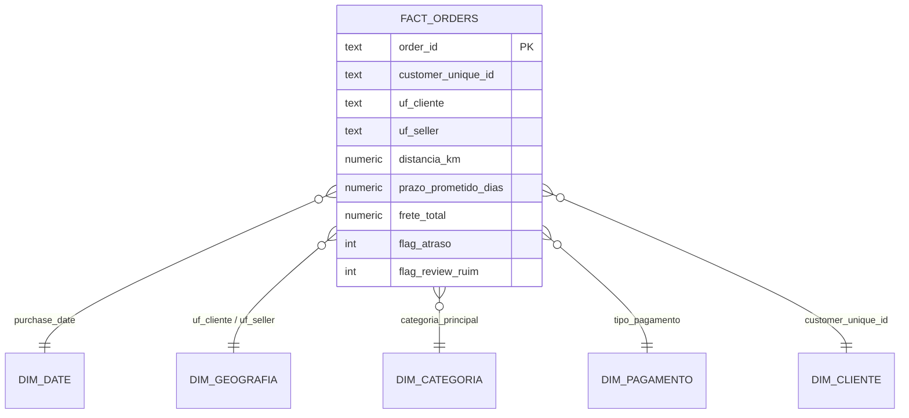

<p align="center">
  
</p>

# Olist Logistics Prediction

> **Análise de performance logística, satisfação e valor do cliente em um marketplace brasileiro.**
> Projeto data fullstack cobrindo **Engenharia de Dados**, **Análise estatística** e **BI** sobre o
> *Brazilian E-Commerce Public Dataset by Olist* (Kaggle).

---

## 1. Problema de negócio

> **Quais fatores explicam os atrasos de entrega e as quedas de satisfação — e onde está o valor em risco?**

O grão de toda a análise é **1 linha = 1 pedido entregue**. Três frentes de leitura:

| Frente | Pergunta | Métricas-chave |
|--------|----------|----------------|
| **Logística** | O que causa os atrasos? | `flag_atraso`, lead time, prazo prometido, rotas |
| **Satisfação** | O que derruba a nota? | `review_score`, % review ruim (≤3) |
| **Valor do cliente** | Quem são os clientes e quanto valem? | receita, **receita em risco**, recompra/retenção |

---

## 2. Stack

`Python` · `Pandas` · `SQLAlchemy / psycopg2` · `PostgreSQL (Neon serverless)` ·
`SciPy / statsmodels` · `Matplotlib / Seaborn` · `Power BI (PBIP/PBIR)`

---

## 3. Arquitetura — Pipeline Medallion



- **raw** — espelho fiel dos CSVs (auditoria/rastreabilidade).
- **staging** — views com tipos corrigidos, datas, padronização de texto e deduplicação.
- **analytics** — modelo dimensional + *marts* prontos para BI.

Orquestração: `python src/run_etl.py` roda raw → staging → analytics (idempotente);
`python src/build_dimensions.py` materializa as dimensões de apoio.

---

## 4. Modelo dimensional (star schema)



`fact_orders` (96.203 pedidos) é o hub. As views `mart_logistics` e `mart_customer_satisfaction`
são "achatadas" sobre o fato para consumo direto no BI. As dimensões (`dim_geografia` com
role-playing UF cliente/seller, `dim_categoria`, `dim_pagamento`, `dim_cliente`) alimentam as
páginas geográfica e de valor do cliente. Dicionário completo em
[`docs/dicionario_dados.md`](docs/dicionario_dados.md); regras de negócio em
[`docs/regras_negocio.md`](docs/regras_negocio.md).

---

## 5. Como rodar

### 5.1 Pré-requisitos
- Python 3.11+
- Conta no [Neon](https://neon.tech) (PostgreSQL serverless) com a *connection string*
- Credenciais da Kaggle API (para baixar os dados)

### 5.2 Setup
```bash
python -m venv .venv && source .venv/bin/activate
pip install -r requirements.txt
cp .env.example .env          # preencha DATABASE_URL, KAGGLE_USERNAME, KAGGLE_KEY
```

### 5.3 Dados (Kaggle)
```bash
kaggle datasets download -d olistbr/brazilian-ecommerce -p data/raw
unzip data/raw/brazilian-ecommerce.zip -d data/raw
```

### 5.4 Banco + ETL
```bash
# cria os schemas raw/staging/analytics (rode 00_schemas.sql no SQL Editor do Neon ou via Python)
python src/run_etl.py          # raw → staging → analytics (com data quality checks)
python src/build_dimensions.py # dim_geografia, dim_categoria, dim_pagamento, dim_cliente
```

### 5.5 Análises e dashboard
```bash
jupyter lab    # execute 01_eda → 02_estatistica
```
Abra o dashboard Power BI em [`dash/`](dash/) (`olist-logistics-prediction.pbip`) — ver
[`dash/README.md`](dash/README.md).

---

## 6. Principais resultados

### 6.1 Análise estatística ([`02_estatistica.ipynb`](notebooks/02_estatistica.ipynb))

| Hipótese | Teste | Resultado | Tamanho de efeito |
|----------|-------|-----------|-------------------|
| Atraso reduz a satisfação | Mann-Whitney U | p < 0.001 | Cliff's δ = 0.55 (**grande**) |
| Frete varia por região | Kruskal-Wallis | p < 0.001 | η² = 0.16 (**grande**) |
| Tipo de pagamento × insatisfação | Qui-quadrado | p = 0.02 | Cramér's V = 0.01 (negligível) |
| Frete × lead time | Spearman | p < 0.001 | ρ = 0.38 (média) |

> Lição relevante: o tipo de pagamento é estatisticamente significativo mas **irrelevante na prática**
> (efeito negligível) — significância ≠ relevância.

### 6.2 Dashboard Power BI ([`dash/`](dash/))

Relatório PBIP/PBIR de **5 páginas** com arco narrativo macro → micro:

| # | Página | Pergunta | Conteúdo |
|---|--------|----------|----------|
| 1 | Visão Executiva | Como está a operação? | 5 KPIs + tendência mensal/trimestral + categorias + distribuição de nota |
| 2 | Logística & Atrasos | O que causa os atrasos? | Efeito-limiar, perfil atrasado×no prazo, dia da semana, dispersão, multi-seller |
| 3 | Satisfação do Cliente | O que derruba a nota? | Atraso×satisfação, 100% empilhado, pagamento, categorias, curva de impacto |
| 4 | Geografia & Regiões | Onde estão as regiões e rotas críticas? | Macro por região (destino×origem) → mapa por UF + top rotas → rankings UF cliente/seller |
| 5 | Valor do Cliente | Quem são os clientes e quanto valem? | Receita, receita em risco, recompra/retenção |

Star schema sobre `analytics`, 35 medidas DAX (KPIs, semáforos via metas, time-intelligence,
receita e recompra). Layout e princípios de UX/UI em [`docs/dashboard_layout.md`](docs/dashboard_layout.md).

---

## 7. Estrutura do projeto

```
olist-logistics-prediction/
├── data/raw/            # CSVs do Kaggle (não versionado)
├── notebooks/           # 01_eda · 02_estatistica
├── src/                 # config · ingest_raw · build_staging · build_analytics · build_dimensions · run_etl
├── sql/                 # 00_schemas · 01_staging_views · 02_analytics_ddl · 03_business_queries
├── reports/             # figuras de EDA/estatística (versionadas)
├── dash/                # dashboard Power BI (.pbip / PBIR)
├── powerbi/backgrounds/ # fundos SVG das páginas (→ rasterizados em PNG)
├── docs/                # dicionário de dados · regras de negócio · layout do dashboard
└── requirements.txt
```

> **Decisões de versionamento:** `data/raw/` e `.env` ficam fora do git (dados pesados e segredos).
> As figuras de `reports/` são versionadas por servirem de portfólio. Os notebooks são versionados
> **com saídas** para visualização direta no GitHub.

---

## 8. Status do projeto

- [x] Fase 0–2 — Setup, aquisição e EDA
- [x] Fase 3–5 — Modelagem dimensional, Neon e ETL (raw → staging → analytics + dimensões)
- [x] Fase 6 — SQL Analytics (12 queries de negócio)
- [x] Fase 7 — Análise estatística (4 testes com tamanho de efeito)
- [x] Fase 8 — Dashboard Power BI (5 páginas, storytelling + UX/UI)
- [ ] Fase 9 — Fechamento de portfólio
